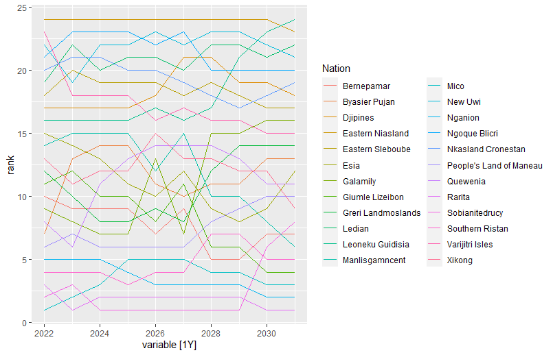
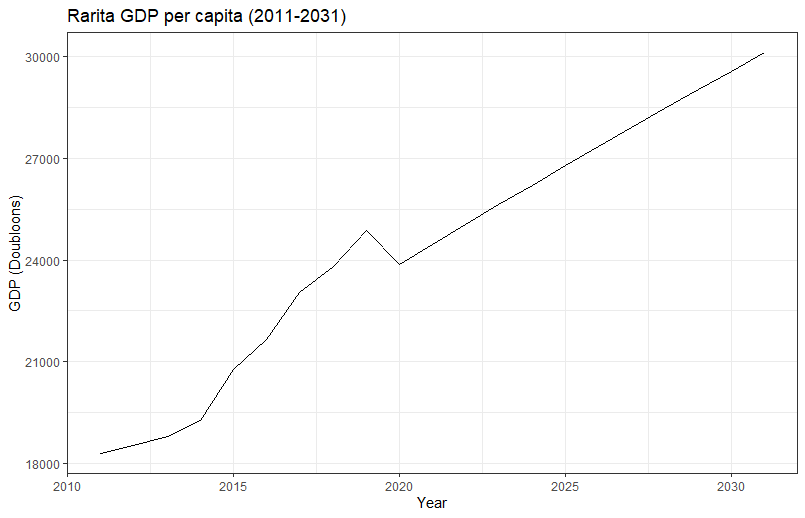
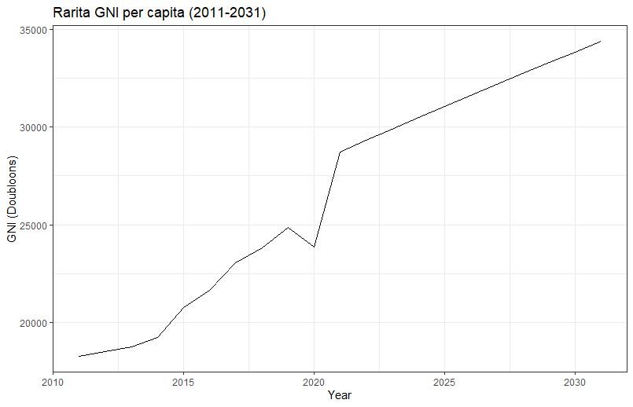
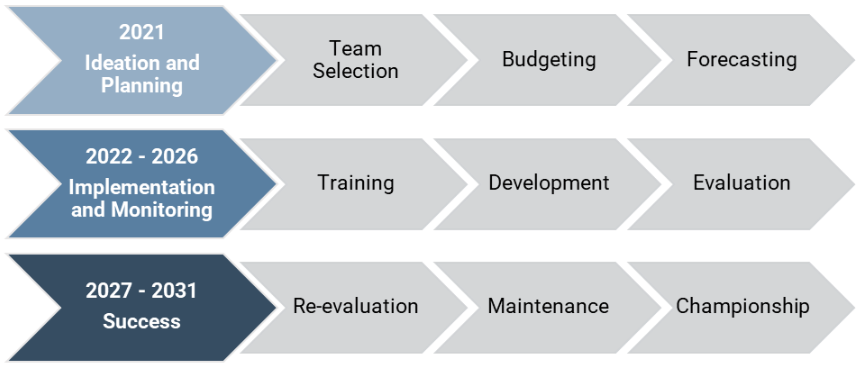
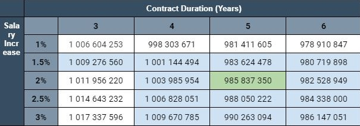
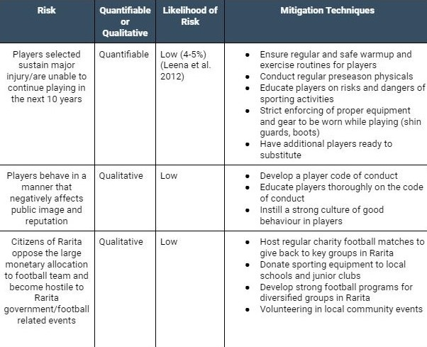

<p align="center">
 
 
</p>

By: Aaron Vu, Aimon Mostofi, James Ngo, Liam La and Nathan Truong

---

## **Objective Overview**

The objective of this study is to create a competitive national football team for Rarita to build a brand and
create positive economic opportunities. A team is defined as competitive by Commissioner Bayes if they:
 1. Rank within the top 10 members of the FSA for the season within the next 5 years with,
 2. High probability of achieving an FSA championship within the next 10 years. 

Our Rarita team consisted of 15 players who are forecasted to perform extremely well on an international level within the next 10 years. The team will bring great economic growth to the country and the affects, risks and selection of the team is explored further in this study.

---

## **Libraries, Data Cleaning and Data Limitations**
The R Code for this project can be accessed [here](Assignment_Code.R). The packages that were utilised are shown below.
```{r}
library(readxl)
library(dplyr)
library(tidyr)
library(reshape2)
library(ggplot2)
library(randomForest)
library(gbm)
library(future)
library(caret)
library(fpp3)
library(future.apply)
library(forecast)
library(class)
library(visdat)
```

The data used was provided by SOA. Three data sets were used:
- [Economy Data](2022-student-research-case-study-economic-data.xlsx)
- [Football Data](2022-student-research-case-study-football-soccer-data.xlsx)
- [Player Data](2022-student-research-case-study-player-data.xlsx)

The cleaning applied and the limitations of these datasets are listed below:

* **Tournament Data Missing 2020 Values** <br /> The absence of 2020 data for tournament passing and goalkeeping meant the probability models were trained solely through 2021. This resulted in a slightly weaker analysis as the data size was reduced.
* **Tournament, League, Revenue and Expense Data NA Values** <br /> This investigation dealt with NA values by omitting them from the analysis. This resulted in data loss however was mitigated by selecting relevant columns first. This enabled the investigations to omit fewer values.
* **Tournament and League Data Negative Values** <br /> The data contained negative values which had meaningless real-life interpretations. As these values represented a significant portion of the total dataset, they were adjusted. The adjustment involved scaling the values between a range of 0 to 1 to provide a parameter based on relative performance. Below is the function used to perform the adjustment on each statistic.

```{r}
standardise <- function (column) {
  result <- (column - min(column))/(max(column) - min(column))
  return(result)
}
```
* **Limited Historic Data** <br /> The limited years of data for economic and player data limited the accuracy of models. This was specifically prevalent for social media where only a single year was provided.


---

## **Team Selection**

Football teams have different formations for positioning themselves on the pitch. The most common and effective formation was determined to be the 1-4-3-3 formation consisting of 1 goalkeeper, 4 defenders, 3 midfielders and 3 forwards. The Raritan football team was selected based on this formation including a substitute for each role. The competitive football team comprises 15 of the top Raritan born players that have participated in a league in 2021. They were chosen based on specific attributes that are most important to their role. 

These attributes were chosen through exploring the correlation between each statistic and the rank from the teams that participated in the 2020 and 2021 FSA tournament. Statistics most correlated with rank were used as variables to build a model and the statistic that most embodied the definition of the role was chosen as the dependent variable. The dependent variables chosen were:
- Goalkeepers - Percentage of saves per shot on target (Saves%)
- Defenders - Successful pressure percentage (Pressure%)
- Midfielders - Pass completion percentage (Completion%)
- Forwards - Number of goals (Goals)

A combination of different statistics between shooting, passing, defense and goalkeeping were chosen as independent variables based on both correlation and importance for each role. They are shown below along with their correlation to rank.


#### Goalkeepers

| Predictors | Correlation With Rank |
| :---: | :---: |
| Age | 0.13 |
| Playing Time MP | -0.69 |
| Performance GA90 | 0.66 |
| Performance SoTA | 0.65 |
| W | -0.81 |
| L | 0.58 |
| Performance CS% | -0.56 |
| Penalty Kicks PKsv | 0.37 |
| Penalty Kicks Save% | 0.28 |

#### Defenders

| Predictors | Correlation With Rank |
| :---: | :---: |
| Age | -0.10 |
| Tackles Tkl | 0.21 |
| Vs Dribbles Past | 0.16 |
| Pressures Def 3rd | 0.36 |
| Pressures Press | 0.35 |
| Blocks Blocks | 0.15 |
| Tkl+Int | 0.17 |
| Total Cmp% | -0.34 |
| 1/3 | -0.29 |
| Prog | -0.18 |

#### Midfielders 

| Predictors | Correlation With Rank |
| :---: | :---: |
| Age | -0.01 |
| 90s | -0.44 | 
| Total Cmp | -0.31 |
| Medium Att | -0.31 |
| 1/3 | -0.30 |
| Total TotDist | -0.29 |
| Tackles Mid 3rd | -0.27 |
| Prog | -0.26 |
| Total PrgDist | -0.20 |
| Blocks Pass | -0.13 |

#### Forwards

| Predictors | Correlation With Rank |
| :---: | :---: |
| Age  | 0.21 |
| 90s | -0.30 |
| Standard Sh | -0.16 |
| Standard FK | -0.22 |
| Total Cmp | -0.17 |
| KP | -0.16 |
| Total Att | -0.15 |
| xA | -0.14 |
| Expected xG | -0.13 |
| Gls | -0.10 |

 
### **Modelling Player Selection**

Multi-linear regression, K-nearest neighbours, bagging, random forest and boosting were the models chosen to model the players. A combination of the FSA tournament and league data was utilised to test and train the models. For each role, the model with the lowest mean squared error and highest R squared was used to predict the Raritan players' performance. The players were then ranked and the top players were chosen for the team. The players chosen were under age 30 in 2021 and their salaries were also considered to ensure economic viability.

Below is the process for selecting the model to choose the goalkeepers. 
The league goalkeeper and tournament goalkeeper data was firstly combined and transformed into a suitable format.

```{r}
#Transform playLeagueGoalkeep to combine with playTournGoalKeep
leagueGoalkeep <- playLeagueGoalkeep %>%
  select(-League) %>%
  rename('League' = `Squad`)

#Combine to create training dataset
goalkeeperTotal <- na.omit(rbind(leagueGoalkeep, playTournGoalkeep)) %>%
  select(-c(Born, Player, Pos, League, `Playing Time Starts`, 
            `Playing Time Min`, `Playing Time 90s`, `Performance GA`, 
            `Performance PKatt`, `D`, `Performance CS`,
            `Performance PKatt`, `Penalty Kicks PKA`, `Penalty Kicks PKm`, `Performance Saves`)) %>%
  mutate_if(is.numeric,standardise) %>%
  rename_with(~gsub(" ", "_", .)) %>%
  rename('Performance_Saves' = `Performance_Save%`) %>%
  rename('Performance_CS' = `Performance_CS%`) %>%
  rename('Penalty_Kick_Save' = `Penalty_Kicks_Save%`)
```

The training and testing dataset was split 75% to 25% using `sample()`.

```{r}
#Training and test dataset.
goalkeeperTraining <- goalkeeperTotal %>%
  filter(Nation != 'Rarita') %>%
  select(-c(Nation, Year))

set.seed(0)
GKtrain <- sample(nrow(goalkeeperTraining), round(nrow(goalkeeperTraining)*0.75))
goalkeeperTest <- goalkeeperTraining[-GKtrain,]
```

The players from Rarita were also filtered out and not used in the modelling process.

```{r}
#Rarita dataset
goalkeeperRarita <- goalkeeperTotal %>%
  filter(Nation == 'Rarita' & Year == 1) %>%
  select(-c(Nation,Year))

goalkeeperRaritaName <- na.omit(rbind(leagueGoalkeep, playTournGoalkeep)) %>%
  filter(Nation == 'Rarita' & Year == 2021)
```
From these datasets we can build the different models. Below is the code and parameter selection for each of the models.


#### Multi-Linear Regression
```{r}
linearGK <- glm(Performance_Saves ~ ., data = goalkeeperTraining, subset = GKtrain, family = 'gaussian')
summary(linearGK)
yhat_lr <- predict(linearGK, newdata = goalkeeperTraining[-GKtrain,])
gk_LR_MSE <- mean((yhat_lr - goalkeeperTraining$Performance_Saves[-GKtrain])^2)
gk_LR_R <- RSquare(goalkeeperTraining$Performance_Saves[-GKtrain],yhat_lr)
```

#### K-Nearest Neighbours

First, the optimal value of K must be chosen based on the lowest error.
```{r}
i=1
k.optm=1
for (i in seq(from=1, to=20, by=1)){
  knn.mod <-  knnreg(goalkeeperTraining[GKtrain,-4], goalkeeperTraining$Performance_Saves[GKtrain], k=i)
  yhat <- predict(knn.mod,goalkeeperTraining[-GKtrain,-4])
  k.optm[i] <- mean((yhat - goalkeeperTraining$Performance_Saves[-GKtrain])^2)
}
```
We can then use the best value of k = 2 to build the KNN model.
```{r}
knnGK <- knnreg(goalkeeperTraining[GKtrain,-4], goalkeeperTraining$Performance_Saves[GKtrain], k=2)
yhat_knn<- predict(knnGK,goalkeeperTraining[-GKtrain,-4])
gk_KNN_MSE <- mean((yhat_knn - goalkeeperTraining$Performance_Saves[-GKtrain])^2)
gk_KNN_R <- RSquare(goalkeeperTraining$Performance_Saves[-GKtrain],yhat_knn)
```

#### Bagging
For the bagging model, 5000 trees were used and as there were 9 predictors the value of `mtry` is 9.
```{r}
set.seed(1)
bagGK <- randomForest(Performance_Saves ~ ., data = goalkeeperTraining, subset = GKtrain, mtry = 9, ntree = 5000, importance = TRUE)
yhat_bg <- predict(bagGK, newdata = goalkeeperTraining[-GKtrain,], n.trees = 5000)
gk_bag_MSE <- mean((yhat_bg - goalkeeperTraining$Performance_Saves[-GKtrain])^2)
gk_bag_R <- RSquare(goalkeeperTraining$Performance_Saves[-GKtrain],yhat_bg)
```

#### Random Forest
For the random forest model, 5000 trees were used and the number of predictors chosen was based on the lowest out-of-bag error.
```{r}
set.seed(1)
tuneRF(goalkeeperTraining[GKtrain,-4], goalkeeperTraining$Performance_Saves[GKtrain], stepFactor = 0.9, ntree=5000)
```
The number of predictors was chosen as 8 as this gave the lowest OOB. Thus, the value of `mtry` is 8.
```{r}
rfGK <- randomForest(Performance_Saves ~ ., data = goalkeeperTraining, subset = GKtrain, mtry = 8, ntree = 5000, importance = TRUE)
yhat_rf <- predict(rfGK, newdata = goalkeeperTraining[-GKtrain,], n.trees = 5000)
gk_RF_MSE <- mean((yhat_rf - goalkeeperTraining$Performance_Saves[-GKtrain])^2)
gk_RF_R <- RSquare(goalkeeperTraining$Performance_Saves[-GKtrain],yhat_rf)
```

#### Boosting
The number of trees utilised for the boosting model was choosen to give the smallest cross-validation error. This resulted in 1000 trees.
```{r}
boostGK <- gbm(Performance_Saves ~ ., data = goalkeeperTraining[GKtrain,], distribution = "gaussian", n.trees = 1000, interaction.depth = 5, cv.folds = 10)
best.iter <- gbm.perf(boostGK, method="cv")
yhat_boost <- predict(boostGK, newdata = goalkeeperTraining[-GKtrain,],n.trees = 1000)
gk_boost_MSE <- mean((yhat_boost - goalkeeperTraining$Performance_Saves[-GKtrain])^2)
gk_boost_R <- RSquare(goalkeeperTraining$Performance_Saves[-GKtrain],yhat_boost)
```

### **Choosing the Model**
From these models, we have also calculated the MSE and R^2. The R^2 was calculated as below,
```{r}
RSquare <- function(y_actual,y_predict){
  cor(y_actual,y_predict)^2
}
```
For the goalkeeper models, the MSE and R^2 for each model was,

| **Model** | **MSE** | **R Square** |
| :---: | :---: | :---: |
| Multi-linear Regression | 0.007275711 | 0.5507444 |
| K-Nearest Neighbours | 0.004998123 | 0.7290712 | 
| Bagging | 0.007080357 | 0.5908597 |
| Random Forest | 0.007319475 | 0.5770460 |
| Boosting | 0.009113703 | 0.4429678 |

As the KNN model has the lowest MSE and highest R^2, the KNN model was chosen as the best model to predict the Rarita players performance. 
```{r}
gkPred <- predict(knnGK, newdata = goalkeeperRarita[,-5])
```
From the predicted values, the top 2 goalkeepers were chosen. This process was repeated for the defenders, midfielders and forwards. The MSE and R^2 of the models for each of the other positions are shown below.

#### Defenders

| **Model** | **MSE** | **R Square** |
| :---: | :---: | :---: |
| Multi-linear Regression | 0.005752477 | 0.11062766 |
| K-Nearest Neighbours | 0.006058334 | 0.07471167 |
| Bagging | 0.006335879 | 0.07147108 |
| Random Forest | 0.005986248 | 0.09114180 |
| Boosting | 0.006331765 | 0.11040315 |

> The multi-linear regression model had the lowest MSE and the highest R^2 and was chosen as the best model for defenders.

#### Midfielders

| **Model** | **MSE** | **R Square** |
| :---: | :---: | :---: |
| Multi-linear Regression | 0.00005803288 | 0.9914495 | 
| K-Nearest Neighbours | 0.00013630598 | 0.9795390 |
| Bagging | 0.00008030216 | 0.9879938 |
| Random Forest | 0.00008036564 | 0.9879725 |
| Boosting | 0.00013228586 | 0.9805513 |

> The multi-linear regression model had the lowest MSE and the highest R^2 and was chosen as the best model for midfielders.

#### Forwards

| **Model** | **MSE** | **R Square** |
| :---: | :---: | :---: |
| Multi-linear Regression | 0.0008249397 | 0.4811610 |
| K-Nearest Neighbours | 0.0014446711 | 0.2622476 |
| Bagging | 0.0009745583 | 0.4216689 |
| Random Forest | 0.0009426277 | 0.4284739 |
| Boosting | 0.0013975958 | 0.1560272 |

> The multi-linear regression model had the lowest MSE and the highest R^2 and was chosen as the best model for forwards.

## **Rarita's National Team**

| **Name** | **Year of Birth** | **Position** |
| :---: | :---: | :---: |
| C. Tukamushaba | 1995 | Defender | 
| E. Mudzingwa  | 1994 | Forward |
| F. Ajio | 1991 | Forward |
| F. Akumu | 2000 | Goalkeeper |
| F. Chin | 1997 | Midfield |
| F. Ithungu | 1992 | Goalkeeper |
| F. Yunusa | 1994 | Defender |
| H. Makumbi | 1993 | Forward |
| H. Zare | 1991 | Defender |
| N. Terzi | 1998 | Defender |
| O. Wanjala | 1996 | Midfield |
| Q. bin Ismail | 1996 | Defender |
| S. Barman | 1995 | Midfield |
| X. Leroy | 1994 | Midfield |
| X. Thomas | 1991 | Forward |

---

## **Probability of Competitiveness**

The 2021 FSA tournament data and rankings were used to train a bagging model with 5000 trees to forecast the probabilities of the team becoming competitive within the next 10 years. A team average for each of the 4 variables, Saves%, Pressure%, Completion% and Goals was used to train the model. Two separate bagging models were trained, one whose output was the teams rank (Rank Model) and the other a probability of the team ranking top 10 in the next season (TT Model). Below represents the Rank Model and TT Model which utilised a combined and transformed 2021 tournament dataset. 
```{r}
#Rank Model
bagprob <- randomForest((Rank)~.,data=modelData,mtry=4,ntree=5000,importance=TRUE)

#TT Model
bagprobTT <- randomForest(factor(Rank)~.,data=modelDataTT,mtry=4,ntree=5000,importance=TRUE)
```
> Both bagging models utilised 5000 trees and 4 predictors. 

To account for changes in player skill from age and experience, each player in the 2021 FSA tournament and the selected Raritan team was exposed to a scaled increase/decrease in their Saves%, Pressure%, Completion% or Goals based on their age each year. For certain age ranges, a player has a chance to either increase or decrease their score by a value between 0-10%. A uniform distribution was used to determine whether their value increased or decreased and the percentage their value would change by. This effectively allows the teams to change in skill each year. The table below showcases the age ranges, the probabilities of their value changing and the percentage change.

| Age | <= 24 | 24 - 27 | 27 - 32 | 32 - 35 | 35 <= |
| :---: | :---: | :---: | :---: | :---: | :---: |
| Chance to Increase or Decrease Value | 90% chance to **increase** by 0% - 10% |  75% chance to **increase** by 0% - 10% | 100% chance to stay the same | 75% chance to **decrease** by 0% - 10% | 90% chance to **decrease** by 0% - 10% |

Below is the function that was used the rules in the table above to change each players skill each year.

```{r}
playerStat <- function(Born,Stat,Year) {
  ifelse((Year - Born) <= 24,Stat*(1 + ifelse(runif(1) <= 0.9, runif(1)*0.1, -runif(1)*0.1)),
         ifelse((Year - Born) <= 27,Stat*(1 + ifelse(runif(1) <= 0.75, runif(1)*0.1, -runif(1)*0.1)),
                ifelse((Year - Born) <= 32, Stat,
                       ifelse((Year - Born) <= 35, Stat*(1 - ifelse(runif(1) <= 0.75, runif(1)*0.1, -runif(1)*0.1)),
                              Stat*(1 - ifelse(runif(1) <= 0.9, runif(1)*0.1, -runif(1)*0.1))))))
}
```

>`ifelse` had to be used instead of `if` and `else` statements so that the function could be applied in a pipeline.

Simulations were then run to determine, the ranking of the teams over the next 10 years. Below is an example of 1 simulation for the performance of the teams in the next 10 years. Here Rarita ranks 3rd in 2022.



Using the forecasts from the TT Model, 5000 simulations were averaged to determine the probability of the Raritan football team ranking at least top 10 in the next 5 years. The results are summarised in the table below.

| Year | 2022 | 2023 | 2024 | 2025 | 2026 |
| :---: | :---: | :---: | :---: | :---: | :---: |
| **Average Probability of Top 10** | 0.8729 | 0.8827 | 0.8834 | 0.8832 | 0.8816 |
| **Probability Range** | 0.8384 - 0.9048 | 0.8384 - 0.9048 | 0.8384 - 0.9048 | 0.8210 - 0.9112 | 0.7474 - 0.9130 |

Using the forecasts from the Rank Model, 5000 simulations were run to determine the probability of the Raritan team ranking 1st in the FSA tournament in the next 10 years. The results are summarised in the table below.

| Year | 2022 | 2023 | 2024 | 2025 | 2026 | 2027 | 2028 | 2029 | 2030 | 2031 |
| :---: | :---: | :---: | :---: | :---: | :---: | :---: | :---: | :---: | :---: | :---: |
| **Probability of Placing 1st** | 0.2048 | 0.4910 | 0.6206 | 0.7042 | 0.8008 | 0.8928 | 0.9462 | 0.9768 | 0.9882 | 0.9884 |

As the selected Raritan team is forecasted to have a high chance of ranking top 10 in the next 5 years and high chance of claiming a FSA championship in the next 10 years, the selected team can be considered competitive. 

---
## **Economic Impact**

For this analysis the chosen team is assumed to satisfy the "competitive" definition over the next 10 years. Forecasts of GDP, GNI and relevant league revenues/expenses have been provided, allowing an assessment of the team's impact on the Raritan economy.

Rarita’s competitive team will directly boost revenues through increased matchday, broadcasting and commercial sources such as increased ticket sales and merchandising. This revenue will increase as the team becomes more competitive due to higher support from fans both in Rarita and internationally. Similarly, expenses are also expected to increase in the later years as the team becomes more competitive and more money is invested into staff and training facilities. The table below showcases the forecast of direct revenues and expenses over the next 10 years.

| Year | Revenue (∂) | Expenses (∂) |
| :---: | :---: | :---: |
| 2022 | 84 340 456 | 71 577 826 |
| 2023 | 100 238 462 | 77 591 022 |
| 2024 | 116 267 196 | 83 652 798 |
| 2025 | 132 426 656 | 89 762 615 |
| 2026 | 148 716 844 | 95 920 473 |
| 2027 | 165 137 758 | 102 126 372 |
| 2028 | 181 689 400 | 108 380 311 |
| 2029 | 198 371 769 | 114 682 291 |
| 2030 | 215 184 865 | 121 032 312 |
| 2031 | 231 128 688 | 127 430 373 |

Rarita's historical football league data was used to forecast revenues and expenses, producing two ETS models with and without the impact of the team that are shown below.

```{r}
# Revenue forecasts
NNTR <- ets(TR,model = "AAN") %>% forecast(h=11) # revenues without national team
YNTR <- ets(TR,model = "AAN", alpha = 0.1) %>% forecast(h=11) # revenues with national team

# Expense forecasts
NNTE <- ets(TE,model = "AAN") %>% forecast(h=11) #expenses w/o national team
YNTE <- ets(TE,model = "AAN", alpha = 0.75, beta = 0.9) %>% forecast(h=11) #expenses w/ national team
```

The difference between revenue minus expenses in these two models represents additional profit resulting from the national team, shown in the table below alongside total profits for each year. This data shows that in the later years of the forecast the additional profit accounts for up to 15% of total football profit, indicating a significant financial benefit as a result of continued international success.

| Year | Total Profit (∂) | Additional Profit (∂) | % of Total |
| :---: | :---: | :---: | :---: |
| 2022 | 427 465 532 | 12 763 170 | 2.99% |
| 2023 | 453 516 194 | 22 647 440 | 4.99% |
| 2024 | 479 770 791 | 32 614 397 | 7.00% |
| 2025 | 506 229 323 | 42 664 041 | 8.43% |
| 2026 | 532 891 789 | 52 796 370 | 9.91% |
| 2027 | 559 758 191 | 63 011 386 | 11.26% |
| 2028 | 586 828 528 | 73 309 089 | 12.49% |
| 2029 | 614 102 800 | 83 689 478 | 13.63% |
| 2030 | 641 581 007 | 94 152 553 | 14.68% |
| 2031 | 669 293 149 | 104 698 314 | 15.64% |

ARIMA models were produced using historical data for both GDP and GNI and forecasts for 2021-2031 were produced. As the provided GDP and GNI data was per capita the Rarita population was also forecast to enable accurate per capita forecasts of GDP and GNI. The code for these forecasts can be seen below. 

```{r}
#Population Forecast
tsPop <- ts(ecoRarPopulation$Rarita, start=2011)
mPop <- auto.arima(tsPop) 
mPop %>% forecast(h=11) %>% autoplot()
fPop <- mPop %>% forecast(h=11)

#GDP Rarita Forecast
rarGDPTotal <- cbind(Year = ecoRarGDP$Year,as.data.frame(ecoRarGDP*ecoRarPopulation/10^9)[-1])
tsGDP <- ts(rarGDPTotal$Rarita,start=2011)
mGDP <- auto.arima(tsGDP) 
mGDP %>% forecast(h=11) %>% autoplot()
fGDP <- mGDP %>% forecast(h=11)

#GDP per capita for Rarita
GDPc <- as.numeric(fGDP$mean*10^9/fPop$mean)
rbind(ecoRarGDP%>%select(Year, Rarita),cbind(Year = c(2021:2030),Rarita = GDPc)) %>%
  as_tsibble(index = Year) %>%
  autoplot(Rarita)

#GNI Rarita Forecast
rarGNITotal <- cbind(Year = ecoRarGNI$Year,as.data.frame(ecoRarGNI*ecoRarPopulation/10^9)[-1])
tsGNI <- ts(rarGNITotal$Rarita, start = 2011)
mGNI <- auto.arima(tsGNI)
mGNI %>% forecast(h = 11) %>% autoplot()
fGNI <- mGNI %>% forecast(h = 11)

#GNI per capita for Rarita
GNIc <- as.numeric(fGNI$mean*10^9/fPop$mean)
rbind(ecoRarGDP%>%select(Year,Rarita),cbind(Year = c(2021:2030),Rarita = GNIc)) %>%
  as_tsibble(index = Year) %>%
  autoplot(Rarita)
```
Given the historical data doesn't account for the existence of the national team, the additional profit calculated above was added to GDP and GNI forecasts to capture the effect of the team on these economic indices. These forecasts can be seen below and highlight the positive impact of the proposed implementation plan on the economy.





The above additional profit calculations however do not account for the initial one time sum of 995,000,000 or player salaries. Over the next 10 years, the players are signed to long-term 5 year contracts in which their salaries will increase based on their performance during those years as long-term contracts can improve player productivity (Carmichael, F 2011). As all players are chosen from Rarita, there is no need to borrow players from other countries, resulting in less expenses. The combined yearly salary to fund the players can be found in the table below, and as the total salary across the 10 years is far less than the ∂995,000,000 provided by the government, there is no need for non-government funding.

| Year | Salary (∂) |
| :---: | :---: |
| 2022 | 92 340 000 |
| 2023 | 92 340 000 |
| 2024 | 92 340 000 |
| 2025 | 92 340 000 |
| 2026 | 92 340 000 |
| 2027 | 104 827 470 |
| 2028 | 104 827 470 |
| 2029 | 104 827 470 | 
| 2030 | 104 827 470 |
| 2031 | 104 827 470 |

To account for the initial sum and player salaries, each year player salaries were subtracted from additional profit and the net result was taken from the remaining funding available. This remaining funding was then invested at the forecasted 1 year spot rate for the given year to determine the remaining funding in the following year. The Remaining Funding below showcases these results and highlights in the increase in remaining funds seen in 2031, a positive indicator for subsequent years.

| Year | Remaining Funding (∂) |
| :---: | :---: |
| 2022 | 919 888 128 |
| 2023 | 861 621 841 |
| 2024 | 812 680 079 |
| 2025 | 773 264 941 |
| 2026 | 743 588 341 |
| 2027 | 711 209 738 |
| 2028 | 688 831 694 |
| 2029 | 676 672 796 |
| 2030 | 674 954 169 |
| 2031 | 683 900 010 |

As stated by Rarita, the success of the international team increases global visibility, allowing for increased investment and tourism opportunities. Furthermore, the prize awarded to the FSA champion and the increase in league attendance resulting from the team's success are factors that were unable to be included in the additional profit calculation, however these factors are expected to have a positive impact on overall football profit. In regard to the impact of international success on the Raritan provinces, the increase in GDP shown in the figures above indicates the Raritan government would have additional funding that could be invested into the relatively poorer province of West Rarita.

---
## **Implementation Plan**

This section aims to implement a strategy that creates a competitive football team to reap the benefits of an internationally successful team. This report’s key objectives necessitates a medium-term strategy, meaning success will need to be achieved in the short and long term. The implementation timeline is broken down into three phases, as seen below.



Phase 1 involves selecting the team per skill and budgeting considerations. As aforementioned in the Team Selection, the forecasted probability of placing in the top ten starts high. However, the chance of winning the championship begins low and increases rapidly over several years. This is achieved through a combination of young and prime-aged players, allowing for short-term success and a long-term championship. The selected players are in the table below.

|**Name** | **Year of Birth** | **Position** | **2022-2026 Salary (∂)** | **2027-2031 Salary (∂)** |
| :---: | :---: | :---: | :---: | :---: |
| C. Tukamushaba | 1995 | Defender | 970 000 | 1 082 580 |
| E. Mudzingwa | 1994 | Forward | 16 240 000 | 18 124 848 |
| F. Ajio | 1991 | Forward | 1 990 000 | 2 309 802 |
| F. Akumu |2000 | Goalkeeper | 5 600 000 | 6 624 944 |
| F. Chin | 1997 | Midfield | 1 340 000 | 1 555 344 |
| F. Ithungu | 1992 | Goalkeeper | 1 530 000 | 1 741 726 |
| F. Yunusa | 1994 | Defender | 18 150 000 | 20 256 527 |
| H. Makumbi | 1993 | Forward | 7 430 000 | 8 458 188 |
| H. Zare | 1991 | Defender | 15 430 000 | 17 909 671 |
| N. Terzi | 1998 | Defender | 5 000 000 | 5 803 523 | 
| O. Wanjala | 1996 | Midfield | 1 750 000 | 1 992 171 |
| Q. bin Ismail | 1996 | Defender | 920 000 | 1 047 313 |
| S. Barman | 1995 | Midfield | 8 680 000 | 9 687 419 |
| X. Leroy | 1994 | Midfield | 5 630 000 | 6 283 429 |
| X. Thomas | 1991 | Forward | 1 680 000 | 1 949 984 | 

The players will be offered five-year contracts with a chance to be renewed at the end of 2026. Upon retention, the player will receive a higher inflation-adjusted salary and a bonus based on performance. Without additional data, an estimated team selection in five years is unlikely to be realistic and forecasts were completed with the original 15 players. 

To simulate the performance bonus, two for loops were required. The aforementioned `playerStat` function was simulated throughout the 10 years. The total number of performance increases were then counted and multiplied to a flat 2% bonus. This was performed for a variety of timeframes to conduct sensitivity analysis.

```{r}
for (i in 2023:2031) {
  playerSalaryBonus <- playerSalaryBonus %>%
    mutate_(.dots = setNames(list(paste0("playerStat(Born,`", i - 1,"`,", i,")")), i))
}

for (i in 2022:2030){
  playerSalaryBonus<-playerSalaryBonus%>%
    mutate_(.dots=setNames(list(paste0("ifelse(`",i+1,"`/","`",i,"`>1,1,0)")),i))
}

playerSalaryBonus<-playerSalaryBonus%>%
  mutate(PB3a=rowSums(select(.,`2022`,`2023`,`2023`)),
         PB3b=rowSums(select(.,`2024`,`2025`,`2026`)),
         PB3c=rowSums(select(.,`2027`,`2028`,`2029`)),
         PB4a=rowSums(select(.,`2022`,`2023`,`2023`,`2025`)),
         PB4b=rowSums(select(.,`2026`,`2027`,`2028`,`2029`)),
         PB5=rowSums(select(.,`2022`,`2023`,`2024`,`2025`,`2026`)),
         PB6=rowSums(select(.,`2022`,`2023`,`2024`,`2025`,`2026`,`2027`)),
  )%>%
  select(-c(3:10))
``` 

The salary model also incorporated the first five years of inflation.

```{r}
 
InfCumulated5 <-(1+fInfets$mean[1])*(1+fInfets$mean[2])*(1+fInfets$mean[3])*(1+fInfets$mean[4])*(1+fInfets$mean[5])

playerSalary5<-playerSalaryData%>%
  mutate("PB5"=playerSalaryBonus$PB5,"2023"=`2022`,"2024"=`2022`,"2025"=`2022`,"2026"=`2022`)%>%
  mutate("2027"=`2022`*(1+PB5*0.02)*InfCumulated5)%>%
  mutate("2028"=`2027`,"2029"=`2027`,"2030"=`2027`,"2031"=`2027`)%>%
  select(-Born,-PB5)
```
A sample output is shown in the above table.

As mentioned in the Economic Impact, the team has budgeted to maintain positive net profits throughout the ten-year plan. The revenues forecasted are driven by various sources such as matchday ticket sales. Broadcasting revenues are forecasted to increase as the international reputation of the league benefits from a competitive team. Commercial revenues will also increase from higher merchandise sales and new sponsorships. GDP is expected to increase as the team becomes competitive. Annual forecasts may be found in the previous section.

The implementation and monitoring of the short-term plan will be the focus of Phase 2. Players will undergo rigorous training and development programs. These programs will develop the team’s skills, strategy and culture. The minimum requirement is placing top ten in the championship. Progress will further be monitored annually through three metrics. Forecasted tournament rank, net profits and GDP will be compared with actual data. If progress is underwhelming, revaluations of the team and strategy will be considered.

After the second phase, there will be a five-year re-evaluation to adapt the plan to changing player and financial performances. This involves renewing contracts and potentially selecting new players. The final phase covers the last five years where a championship is the target. Phase 3 will continue to implement development programs and focus on maintaining current success and pushing for the championship.

---

## **Assumptions**

### Key Assumptions

- The best players now will be the best players in the next ten years

- All teams in the FSA tournament remain the same including Rarita, no players get replaced

- Each player in Rarita has a 5 year contract which increases with performance

- Negative statistics were treated as correct and the statistics were scaled between 0 and 1

### Other Assumptions

- Population, GDP, GNI and spot rate forecasts follow an ARIMA model.

- Revenue, expense and inflation forecasts follow an ETS model.

- Team synergy doesn’t affect their playing ability.

- Each player is offered a 5 year contract.

- A player's age affects their playing ability.

- A competitive national football team will increase the GDP.


---
## **Risk and Risk Mitigation Considerations**

### Sensitivity Analysis on Key Assumptions

Total salary expenses varies with different contract length assumptions as well as with different performance increase assumptions. In particular, shorter contract durations have the effect of increasing total expenses in comparison to longer contracts. Clearly, increases in performance also are synonymous with increases in salary expenses. The effects of differing assumptions are seen in the table below. 



For calculating the total salary expenses for different contract lengths, the performance bonuses that were calculated prior were used and the duration of contracts were varied. The example of calculating the 3 year salary expense with a 2 percent performance bonus multiplier is seen below.

```{r}
playerSalary3<-playerSalaryData%>%
  mutate("PB3a"=playerSalaryBonus$PB3a,"PB3b"=playerSalaryBonus$PB3b,"PB3c"=playerSalaryBonus$PB3c,"2023"=2022,"2024"=2022) %>%
  mutate("2025"=2022(1+PB3a0.02)InfCumulated3a)%>% 
  mutate("2026"=2025,"2027"=2025) %>% 
  mutate("2028"=2027(1+PB3b0.02)InfCumulated3b) %>% 
  mutate("2029"=2028,"2030"=2028)%>% 
  mutate("2031"=2030(1+PB3c0.02)InfCumulated3c) %>%
  select(-Born,-PB3a,-PB3b,-PB3c)
sum(playerSalary3[2:11])
```
### Risk Analysis




---
## **References**

Aquino, R, Vieira, L, Carling, C, Martins, G, Alves, I & Puggina, E 2017, ‘Effects of competitive standard,
team formation and playing position on match running performance of Brazil professional soccer
players’, _International Journal of Performance Analysis in Sport_, accessed 14 March 2022 from Taylor &
Francis Online 2021

Carmichael, F, Rossi, G & Simmons, R 2011, ‘Contract duration and player performance in Serie A’,
accessed 14 March 2022,
<https://www.sheffield.ac.uk/polopoly_fs/1.679571!/file/F3_1_Simmons.pdf>

Leena, R, Kettunen, J, Kujala, U and Heinonen, A 2012, ‘Sport injuries as the main cause of sport career
termination among Finnish top-level athletes’, _European Journal of Sport Science_, accessed 14 March
2022 from ResearchGate database

Mujika, I, Vaeyens, R, Matthys, S, Santisteban, J, Goiriena, J & Philippaerts, R 2009, ‘The relative age effect
in professional football club setting’, _Journal of Sports Sciences_, accessed 14 March 2022 from Taylor &
Francis Online 2021

---

## ⚽**Thank you!!**:soccer:

<p align="center">
 
 
 
 
 
</p>

---


