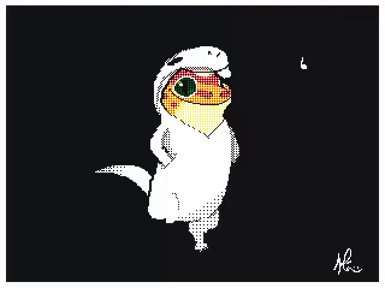

# **SOA Case Study: Rarita Football Team Showcase**
---

## **The Esteemed Geckos :shipit:**



>Aaron Vu, Aimon Mostofi, James Ngo, Liam La and Nathan Truong
---

## Objective Overview

The objective of this study is to create a competitive national football team for Rarita to build a brand and
create positive economic opportunities. A team is defined as competitive by Commissioner Bayes if they:
 1. Rank within the top 10 members of the FSA for the season within the next 5 years with,
 2. High probability of achieving an FSA championship within the next 10 years. 

---

## Team Selection


Below is the function that was used to scale all the statistics to between 0 and 1.
```{r}
standardise <- function (column) {
  result <- (column - min(column))/(max(column) - min(column))
  return(result)
}
```


---

## Rarita's National Team
| **Name** | **Year of Birth** | **Position** |
| :---: | :---: | :---: |
| C. Tukamushaba | 1995 | Defender | 
| E. Mudzingwa  | 1994 | Forward |
| F. Ajio | 1991 | Forward |
| F. Akumu | 2000 | Goalkeeper |
| F. Chin | 1997 | Midfield |
| F. Ithungu | 1992 | Goalkeeper |
| F. Yunusa | 1994 | Defender |
| H. Makumbi | 1993 | Forward |
| H. Zare | 1991 | Defender |
| N. Terzi | 1998 | Defender |
| O. Wanjala | 1996 | Midfield |
| Q. bin Ismail | 1996 | Defender |
| S. Barman | 1995 | Midfield |
| X. Leroy | 1994 | Midfield |
| X. Thomas | 1991 | Forward |


| Age | <= 24 | 24 - 27 | 27 - 32 | 32 - 35 | 35 <= |
| :---: | :---: | :---: | :---: | :---: | :---: |
| Chance to Increase/Decrease Value | 90% chance to increase by 0% - 10% |  75% chance to increase by 0% - 10% | 100% chance to stay the same | 75% chanceto decrease by 0% - 10% | 90% chance to decrease by 0% - 10% |

Below is the function that was used to change each players skill each year.
```{r}
playerStat <- function(Born,Stat,Year) {
  ifelse((Year - Born) <= 24,Stat*(1 + ifelse(runif(1) <= 0.9, runif(1)*0.1, -runif(1)*0.1)),
         ifelse((Year - Born) <= 27,Stat*(1 + ifelse(runif(1) <= 0.75, runif(1)*0.1, -runif(1)*0.1)),
                ifelse((Year - Born) <= 32, Stat,
                       ifelse((Year - Born) <= 35, Stat*(1 - ifelse(runif(1) <= 0.75, runif(1)*0.1, -runif(1)*0.1)),
                              Stat*(1 - ifelse(runif(1) <= 0.9, runif(1)*0.1, -runif(1)*0.1))))))
}
```
>ifelse() had to be used instead of if and else statements so that the function could be applied in a pipeline.


### Congrats on completing the [2022 SOA Research Challenge](https://www.soa.org/research/opportunities/2022-student-research-case-study-challenge/)!

>Now it's time to build your own website to showcase your work.  
>To create a website on GitHub Pages to showcase your work is very easy.

This is written in markdown language. 
>
* Click [4001 link](https://classroom.github.com/a/ggiq0YzO) to accept your group assignment.
* Click [5100 link](https://classroom.github.com/a/uVytCqDv) to accept your group assignment 

#### Follow the [guide doc](Doc1.pdf) to submit your work. 
---
>Be creative! Feel free to link to embed your [data](player_data_salaries_2020.csv), [code](sample-data-clean.ipynb), [image](ACC.png) here

More information on GitHub Pages can be found [here](https://pages.github.com/)


